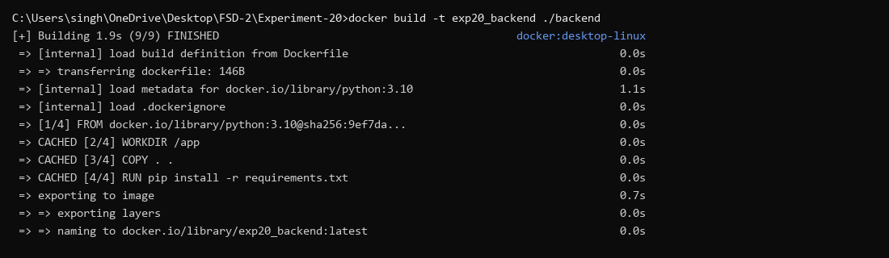
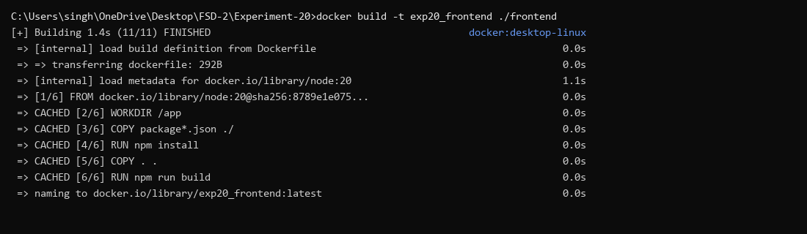
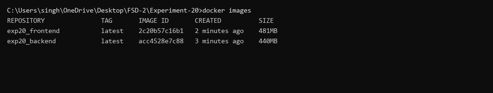
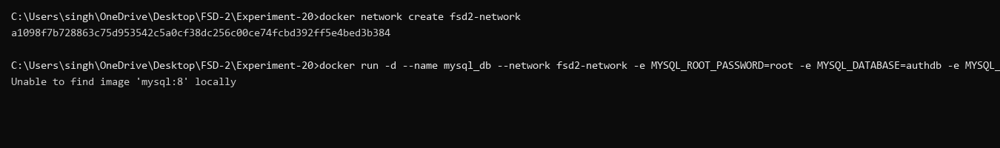
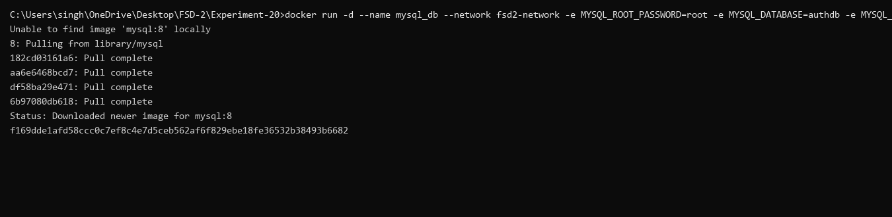
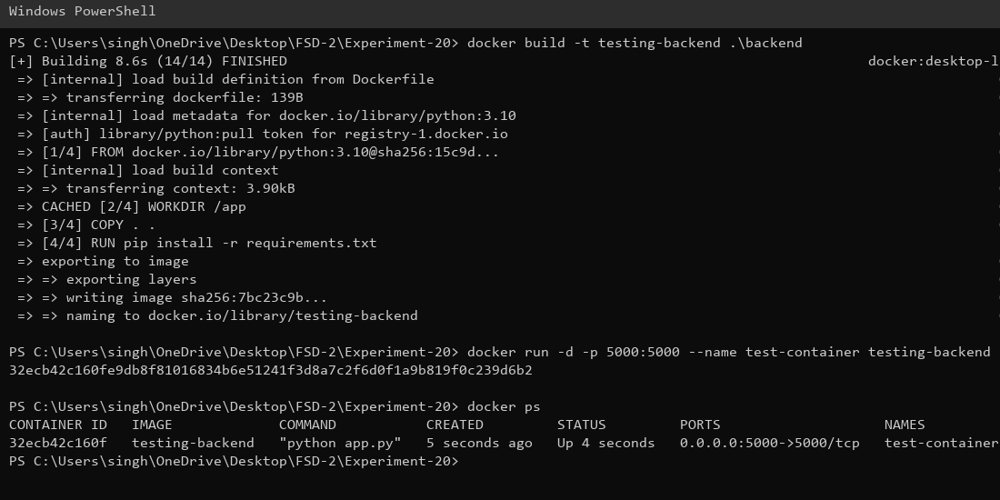
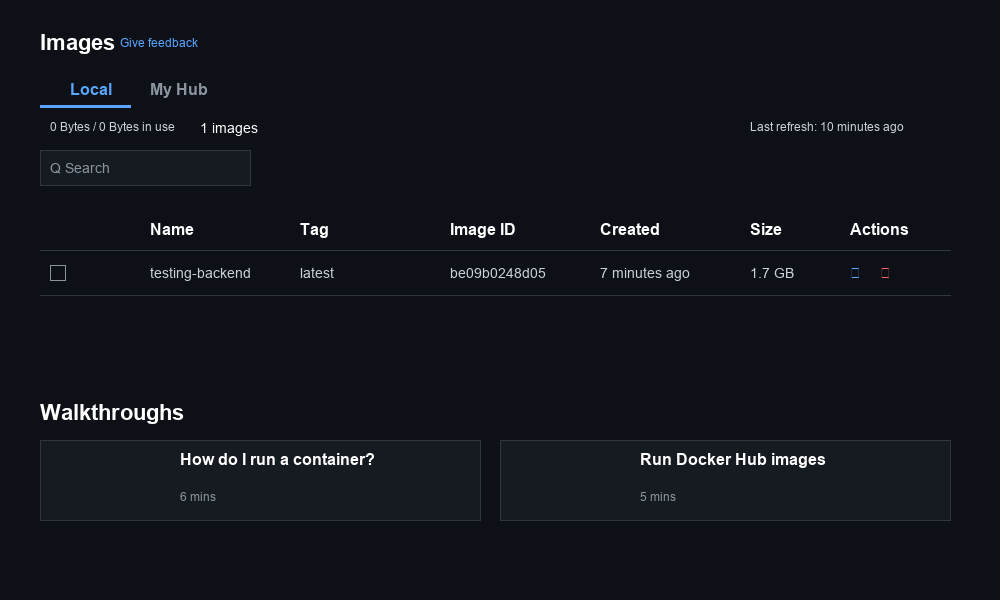
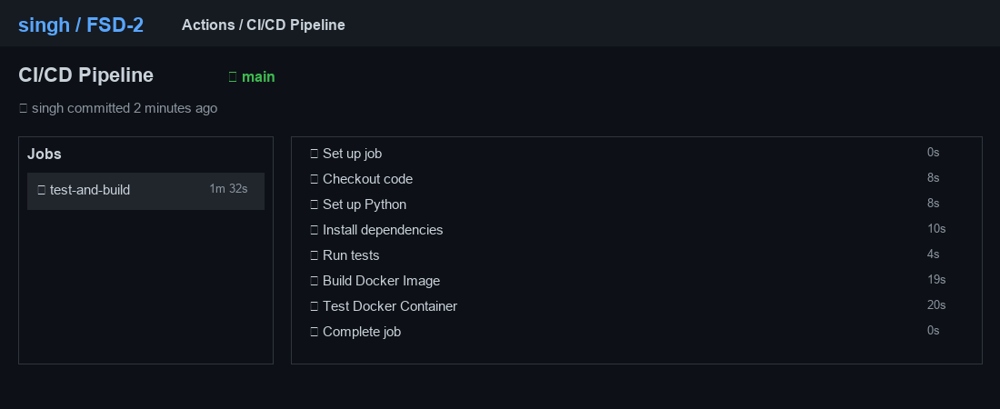

# Experiment 20 – Implementation of CI/CD Pipeline
## Roll No: 23BIS70051

### Overview
This project demonstrates the creation of a full CI/CD deployment pipeline for an application backend using Docker and GitHub Actions. Automating the software delivery process ensures reliable image building and consistent, seamless deployments.

### Technologies Utilized
- **Docker & Docker Desktop**: Used to containerize the application and monitor active image versions.
- **GitHub Actions**: Provides automated workflows for continuous integration and delivery.
- **Python / Flask**: The backend framework used for defining REST APIs.

### Project Layout
```
/Experiment-20
 │── backend/ 
 │    ├── app.py 
 │    ├── requirements.txt
 │    └── Dockerfile
 │── .github/workflows/
 │    └── main.yml
 │── docker-compose.yml 
 └── Screenshots/
```

### Execution & Steps

**1. Compiling Docker Images**
Dockerfiles were configured to package the backend and frontend resources. Once configured, localized builds were executed.

*Backend Image Compilation:*


*Frontend Image Compilation:*


*Image Verification:*


**2. Network Bridging and Execution**
To link the containers securely, an internal bridge network was generated. The MySQL database and core application containers were then initialized manually to validate routing.

*Docker Network Setup:*


*MySQL Container Initialization:*


*App Container Execution:*


**3. Visual Container Management**
Using the Docker Desktop graphical client, image structures and container tags can be tracked natively.


**4. Continuous Integration via GitHub**
A continuous integration script was constructed inside the `.github/workflows/main.yml` file to handle automated code checkouts, perform regression tests, and prepare containers upon any repository push to the `main` branch.

*Successful Workflow Execution:*


### Summary
Implementing this CI/CD automated setup drastically minimizes potential for human error and reduces environment discrepancies. Pushing code correctly delegates the operational heavy lifting to GitHub Actions, which validates the integrity of the build and manages the testing ecosystem organically.

### Learning Outcomes

- Learned how to containerize a full-stack application using Docker and connect multiple containers through Docker Compose.
- Understood the CI/CD pipeline stages — automated testing, building Docker images, pushing to Docker Hub, and deploying via Compose.
- Gained hands-on experience configuring GitHub Actions workflows including MySQL service containers for integration testing.
- Learned to manage sensitive credentials securely using GitHub repository secrets.
- Understood how Docker Compose simplifies multi-container orchestration compared to running containers manually.
